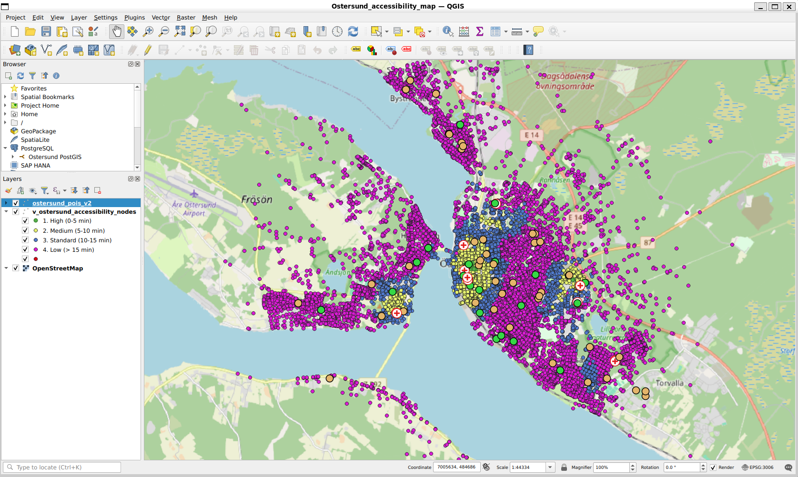

# Nordic Accessibility Engine

An automated backend engine built for high-performance spatial data processing, network graph generation, and multi-source Dijkstra routing to compute granular walking-accessibility metrics. Developed as a technical demonstration for modern geographic availability systems (similar in scope and architecture to national platforms like **PIPOS**).

---

## Technical Overview

This repository houses a production-ready spatial data processing pipeline (`v2`) designed to automate the ingestion, modeling, and analysis of geographic data for public and commercial service accessibility. 

### Core Tech Stack
* **Database & Spatial Engine**: **PostgreSQL** with **PostGIS** for high-speed spatial indexing, geometry manipulations, and topological network storage.
* **GIS & Geoprocessing**: Python with **QGIS** / PyQGIS and spatial libraries for automated geoprocessing and project map generation (`.qgz`).
* **Routing & Analytics**: Custom network graph extraction leveraging node/edge topology and optimized **Dijkstra routing algorithms** for precise walking-distance and travel-time metrics.

---

## Pipeline Architecture (`v2`)

1. **Automated Ingestion (`ingest_ostersund_v2.py`)**: 
   * Connects directly to **PostgreSQL** databases to ingest raw infrastructure layers and point-of-interest (POI) datasets.
   * Cleans, transforms, and standardizes coordinate reference systems (CRS) to guarantee topological consistency via **PostGIS**.
2. **Accessibility Calculation (`calculate_accessibility_v2.py`)**: 
   * Builds routable network graphs from street-network geometries.
   * Executes optimized shortest-path algorithms to compute service catchments and walking accessibility indices around critical public infrastructure and commercial services.
3. **Cartographic Deliverable (`Ostersund_accessibility_map.qgz` / `.pdf`)**:
   * Automates the rendering of high-resolution spatial decision-support maps using **QGIS** for regional planning and stakeholder analysis, mirroring **PIPOS** workflows.

---

## Repository Contents

* `ingest_ostersund_v2.py`: Data pipeline script for database ingestion, schema management, and spatial preprocessing.
* `calculate_accessibility_v2.py`: Core routing engine implementing graph traversal and accessibility distance metrics.
* `Ostersund_accessibility_map.qgz`: **QGIS** project file featuring pre-styled layers for spatial visualization.
* `Ostersund_accessibility_map.pdf`: Exported cartographic map showcasing analysis outputs.

*Click the map image above to open or download the full PDF vector version.*
---

## Professional Alignment

This architecture directly mirrors the requirements for modern geographic availability platforms like **PIPOS** by emphasizing:
* **Data Quality & Governance**: Robust handling of spatial data pipelines, schema verification, and database optimization in **PostgreSQL** / **PostGIS**.
* **Scalable Processing**: Transitioning from manual **QGIS** workflows to fully scriptable, repeatable Python and spatial automation.
* **Decision Support**: Generating reliable, current spatial metrics for public sector planning, regional development, and accessibility monitoring.
